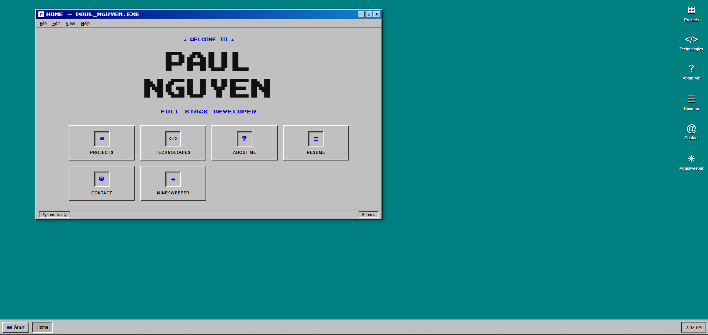

# Paul Nguyen — Portfolio

A personal portfolio site styled as a **Windows 98 desktop**. Each section
(Projects, Technologies, About Me, Resume, Contact) opens as its own draggable,
minimizable window, and there's a fully playable **Minesweeper** clone tucked in
the Start menu.

🔗 **Live site:** [Vercel Link](https://impaul.vercel.app/)



## Features

- **Retro desktop UI** — beveled windows, title bars, a Start menu, a live
  taskbar clock, and desktop icons, all built to feel like classic Windows.
- **Draggable windows** — open, focus, drag, minimize, maximize, and close
  windows; each gets its own taskbar button.
- **Playable Minesweeper** — safe first click, flood-fill reveal, flag /
  question-mark cycling, chord-click, win/lose detection, a mine counter and
  timer, plus Beginner / Intermediate / Expert difficulties.
- **Pixel-art details** — pixelated company logos and pressed-in icon tiles for
  the authentic low-res aesthetic.
- **Embedded resume** — view the resume inside an in-app window or download it.
- **Photo drop-zone** — the About Me photo can be swapped by drag-and-drop.
- **Responsive & accessible** — reflows on smaller screens and respects
  `prefers-reduced-motion`.

## Technologies Used

This is intentionally a **dependency-free static site** — no framework, no build
step, just the fundamentals:

- **HTML5** — semantic markup, one self-contained window per section.
- **CSS3** — custom properties, flexbox & grid, `@media` queries, keyframe
  animations, and `image-rendering: pixelated` for the retro look. All theming
  lives in [`css/style.css`](css/style.css).
- **Vanilla JavaScript (ES6+)** — no libraries. A small window manager handles
  dragging / focus / taskbar state ([`js/script.js`](js/script.js)), and the
  Minesweeper game is a self-contained module ([`js/minesweeper.js`](js/minesweeper.js)).
- **Press Start 2P** — Google Font used for the pixel-style headings and icons.
- **Python** (dev only) — `http.server` serves the site locally via `npm run dev`.
- **Pillow** (asset prep) — used to pixelate and crop the logos/photos.
- Deployed on **Vercel**.

## Inspiration

I wanted my portfolio to feel less like a résumé and more like *opening up my
computer*. The **Windows 95/98 desktop** — with its chunky beveled buttons,
gray windows, and that unmistakable title-bar gradient — is peak nostalgic UI,
so I rebuilt that world from scratch in plain HTML/CSS/JS.

**Minesweeper** was the heart of it: it shipped with those old machines and is
the game everyone secretly played, so a working clone felt like the perfect
easter egg. Building it (and the window manager around it) with no framework was
also a deliberate challenge — to see how much you can do with just the platform
primitives.

## Running Locally

No dependencies to install — it's a static site.

```bash
npm run dev
# then open http://localhost:5173
```

Or without npm:

```bash
python -m http.server 5173
```

> The resume PDF and embedded viewer need to be served over `http://`
> (via the commands above or the deployed site) — opening `index.html`
> directly as a `file://` may block the inline PDF.

## Project Structure

```
Paul_Port_Page/
├── index.html            # all windows + desktop markup
├── css/
│   └── style.css         # Windows-98 theme
├── js/
│   ├── script.js         # window manager, taskbar, start menu, clock
│   └── minesweeper.js    # Minesweeper game logic
├── assets/
│   ├── logos/            # pixelated company / school logos
│   ├── projects/         # project preview screenshots
│   └── photo.jpg         # About Me photo
├── resume.pdf            # downloadable / viewable resume
└── package.json          # dev-server script only
```
